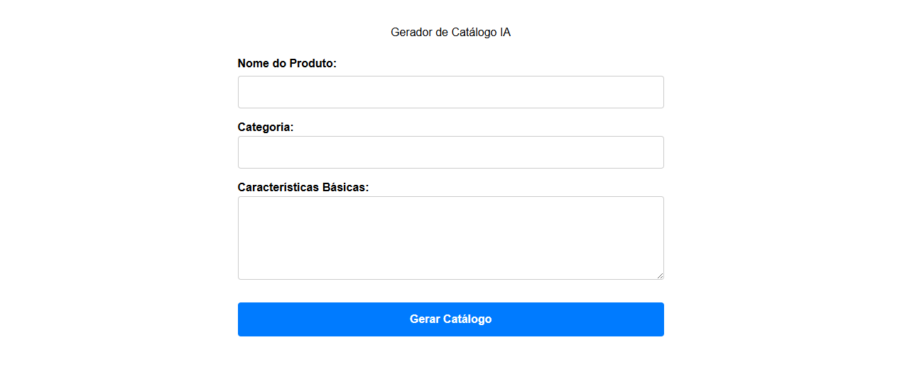
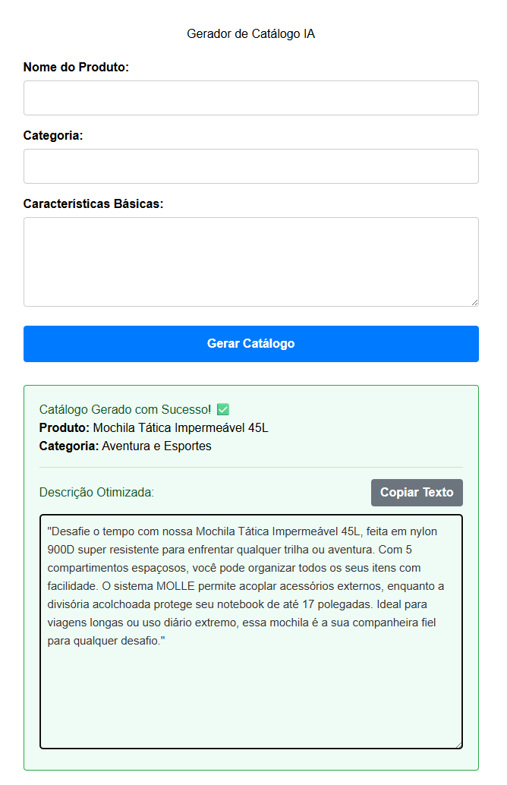

# AI Catalog Generator

Um sistema web projetado para automatizar a criação de catálogos de produtos. O usuário insere dados brutos como nome, categoria e características básicas, e o sistema processa essas informações para gerar descrições comerciais persuasivas e otimizadas para SEO.

Este projeto é um laboratório prático para aprofundamento e consolidação de conhecimentos no ecossistema **PHP/Laravel**, aplicando conceitos sólidos de arquitetura MVC, banco de dados relacional e consumo de APIs externas.

## Stack Tecnológica

* **Linguagem:** PHP 8.x
* **Framework:** Laravel
* **Banco de Dados:** PostgreSQL (via WSL/Docker)
* **Arquitetura:** MVC e Service Pattern
* **Front-end:** React embutido via Vite
* **Inteligência Artificial:** LLMs Local via Ollama

## Aprendizados e Arquitetura

Vindo de uma base em Java/Spring Boot e Node.js, este projeto tem sido fundamental para mapear e adaptar conceitos de injeção de dependências, ORM e rotas para o padrão Laravel.

**Desafio: IA Local e Independência de Infraestrutura**
Inicialmente tentei usar API do gemini de Inteligência Artificial para geração de textos, o sistema lidou com indisponibilidades e restrições de endpoint da API terceira (erros 404/500). 

Para contornar as instabilidades em provedores alterei a arquitetura para consumir LLM local diretamente pelo *Ollama*. Resultou em disponibilidade offline e manteve o Service Pattern limpo e extensível, sem ter problemas futuros com tokens.

## Desenvolvimento

O projeto está em evolução contínua. Abaixo estão meus passos já concluídos e os próximos desafios arquiteturais e de interface:

## Desenvolvimento e Roadmap

O projeto está em evolução contínua. Abaixo estão as etapas concluídas e os próximos desafios arquiteturais, separados por áreas de conhecimento:

### Fases 1 e 2: Fundação e Integração Full-Stack
- [x] Configuração de Banco de Dados, Migrations e Models (`Product`).
- [x] Implementação de Service Pattern e Tratamento de Exceções.
- [x] Pivotagem para motor de IA Local (Ollama) para redução de custos.
- [x] Construção da interface com React (SPA - Single Page Application).

### Fase 3: Experiência do Usuário (UX) e Gestão
- [x] **Dashboard de Histórico:** Criação de rota GET e interface baseada em Cards para exibição de catálogos anteriores.
- [x] **Interatividade de Cópia e Edição:** Inclusão de recursos nativos (Clipboard API) para copiar e alterar resultados dinamicamente.
- [x] **Exclusão de Registros:** Rota de DELETE e atualização de estado no React para remover catálogos indesejados.

### Fase 4: Qualidade e Performance (Próximos Passos)
- [ ] **Filtros e Buscas:** Adicionar barra de pesquisa no Dashboard rodando em tempo real no Front-end (Filtro JS).
- [ ] **Testes Automatizados (PHPUnit / Pest):** Implementar testes unitários e de integração (testando endpoints REST e "Mockando" o serviço de IA).
- [ ] **Filas (Queues & Jobs):** Transferir a chamada da IA para processamento em background (Redis/Database), liberando a tela do usuário imediatamente.

### Fase 5: Segurança e Infraestrutura
- [ ] **Autenticação (Laravel Sanctum):** Proteger as rotas de criação e exclusão, garantindo que apenas usuários logados alterem os catálogos.
- [ ] **Home Lab e Deploy:** Configurar túneis seguros, pensando em Cloudflare Tunnels, para expor a aplicação local com o Ollama para a internet. Ou hospedar em servidor próprio.
- [ ] **Flexibilidade de Providers:** Refatorar o `AiService` para aceitar múltiplas IAs (Local ou Cloud) alternáveis via `.env`.

## Interface atual (atualizado em 15/08/26)

---
*Projeto desenvolvido como portfólio técnico e roteiro prático de estudos.*
