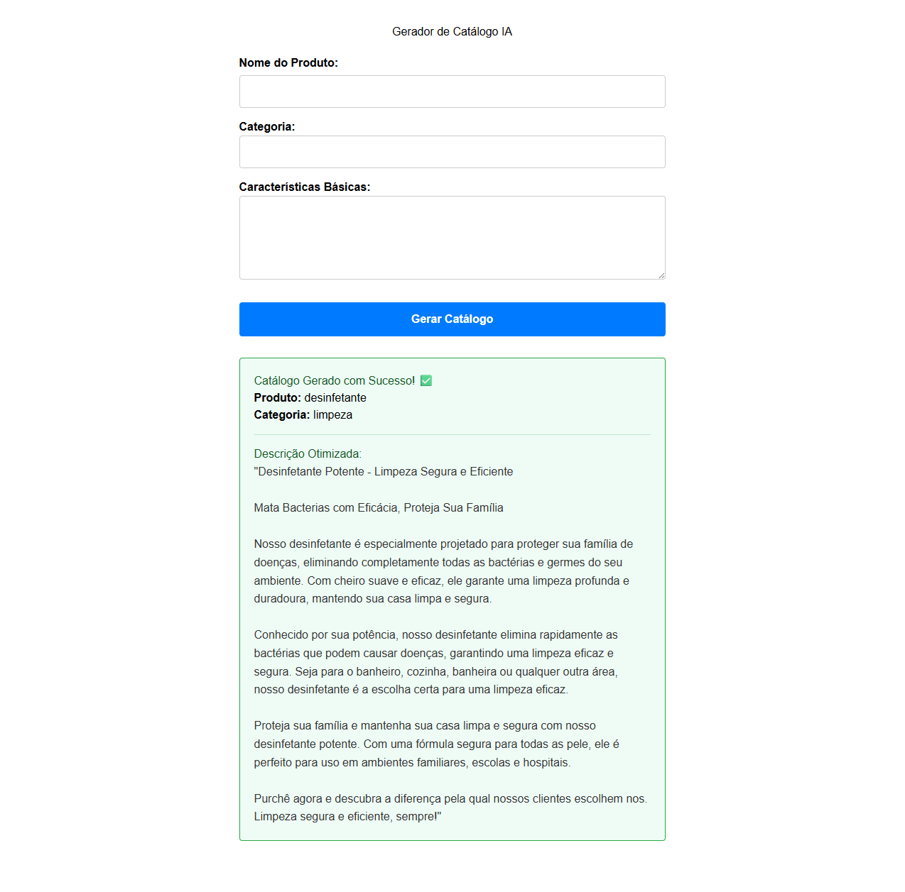
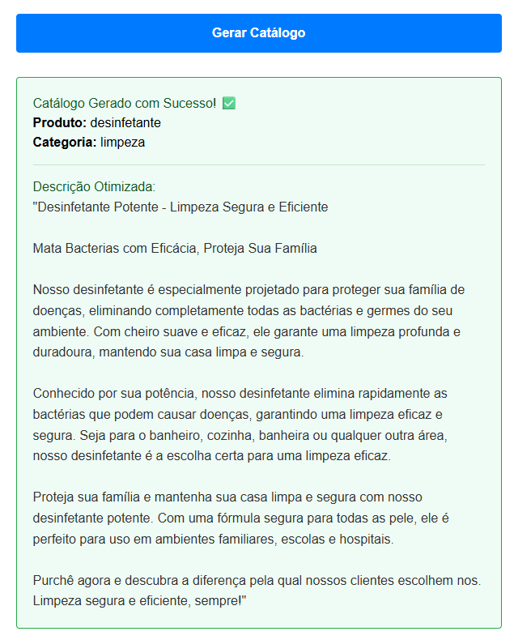

# AI Catalog Generator

Um sistema web projetado para automatizar a criação de catálogos de produtos. O usuário insere dados brutos como nome, categoria e características básicas, e o sistema processa essas informações para gerar descrições comerciais persuasivas e otimizadas para SEO.

Este projeto é um laboratório prático para aprofundamento e consolidação de conhecimentos no ecossistema **PHP/Laravel**, aplicando conceitos sólidos de arquitetura MVC, banco de dados relacional e consumo de APIs externas.

## Stack Tecnológica

* **Linguagem:** PHP 8.x
* **Framework:** Laravel
* **Banco de Dados:** PostgreSQL (via WSL/Docker)
* **Arquitetura:** MVC e Service Pattern
* **Front-end:** React embutido via Vite
* **Inteligência Artificial:** LLMs Local via Ollama

## Aprendizados e Arquitetura

Vindo de uma base em Java/Spring Boot e Node.js, este projeto tem sido fundamental para mapear e adaptar conceitos de injeção de dependências, ORM e rotas para o padrão Laravel.

**Desafio: IA Local e Independência de Infraestrutura**
Inicialmente tentei usar api do gemini de Inteligência Artificial para geração de textos, o sistema lidou com indisponibilidades e restrições de endpoint da API terceira (erros 404/500). 

Para contornar as instabilidades em provedores alterei a arquitetura para consumir LLM local diretamente pelo *Ollama*. Resultou em disponibilidade offline e manteve o Service Pattern limpo e extensível, sem ter problemas futuros con tokens.

## Desenvolvimento

O projeto está em evolução contínua. Abaixo estão meus passos já concluídos e os próximos desafios arquiteturais e de interface:

### Fase 1: Fundação Back-end 
- [x] Configuração do ambiente (WSL, PostgreSQL, VS Code).
- [x] Estruturação do banco de dados com Migrations e Models (`Product`).
- [x] Criação de Controllers para recebimento de requisições.
- [x] Implementação do Service Pattern para isolar lógicas de negócios.
- [x] Tratamento de exceções e Fallback de Segurança em requisições externas.
- [x] Pivotagem para motor de IA Local com Ollama.

### Fase 2: Front 
- [x] Construção do Front-end (React).
- [x] Integração Front/Back via Fetch API.
- [x] Indicadores de carregamento (Loaders) e tratamento de erros visuais enquanto a requisição HTTP é processada.

### Fase 3: Ideias que quero implementar
- [x] **Aprimoramento do resultado:** Colocar forma de alterar o texto sugeido pela IA direto no resultado e conseguir copiar o texto mais fácil.
- [x] **Dashboard:** Criar uma listagem (GET) para exibir o histórico de todos os produtos gerados e salvos no PostgreSQL.
- [ ] **Filas (Queues & Jobs):** Transferir a chamada da IA para um processamento em background nativo do Laravel, liberando a resposta imediata para o usuário.
- [ ] **Autenticação:** Proteger o endpoint de criação de produtos utilizando Laravel Sanctum.
- [ ] **Refinamento da IA:** Manter a flexibilidade do `AiService` para alternar facilmente entre IA Local e provedores Cloud através de variáveis de ambiente.

## Interface atual (atualizado em 15/08/26)

---
*Projeto desenvolvido como portfólio técnico e roteiro prático de estudos.*
